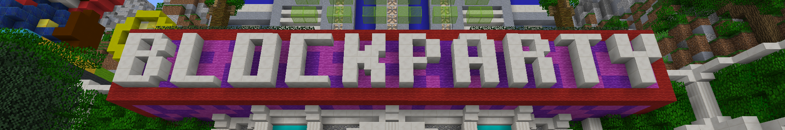
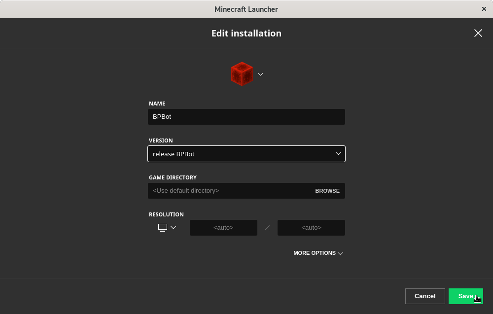
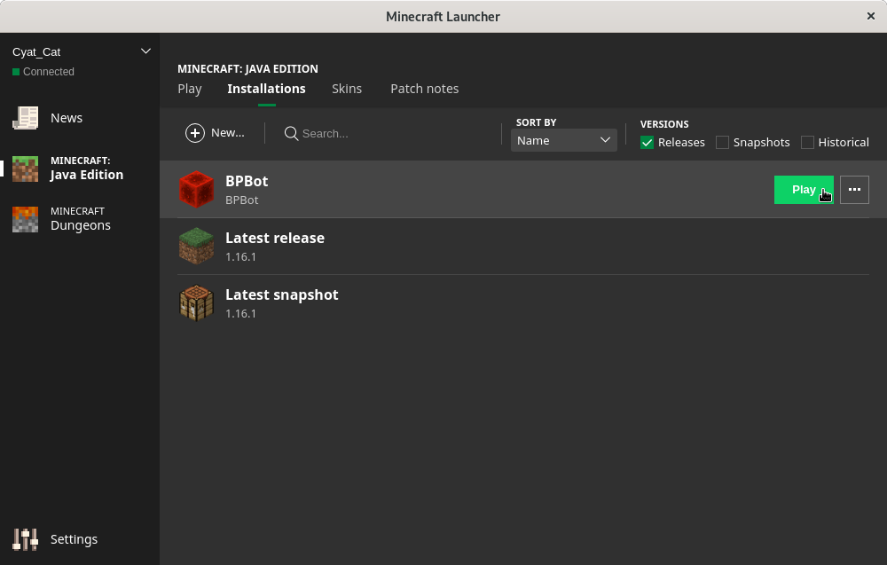

# BPBot


BPBot helps prevent carpal tunnel syndrome by automating your Block Party game play.

**[Disclaimer](#disclaimer)**<br>
**[Inspiration](#inspiration)**<br>
**[Overview](#overview)**<br>
**[Prerequisites](#prerequisites)**<br>
**[Installation Instructions](#installation-instructions)**<br>
**[Usage Instructions](#usage-instructions)**<br>
**[License](#license)**<br>
**[Revision History](#revision-history)**<br>

## Disclaimer

**WARNING**: *Usage of this bot will violate the server rules and is punishable by a permanent ban.*  **USE AT YOUR OWN RISK; you have been warned.**

## Inspiration
* **Tired of wasting your life away on Block Party, but you still want to earn those points?**

* **Are your fingers sore from playing too much, but you still want to earn those points?**

* **Or do you just want to step away from the computer for a moment, and still earn those points?**

## Overview
BPBot is a player emulator that uses software controlled keyboard presses and mouse clicks to automate your Block Party player.  It does not guarantee a win every time nor is it unbeatable, but it will perform at a high level.

When BPBot is enabled, the following actions occur:
* Scans the floor to detect the blocks.
* When a color is called, it will run the player to the closest block.
* Once a new floor is loaded, BPBot will reposition your player at location that has the best probability (i.e. where the most colors are).

Other features include automated chat messages (see the [config files](#config-files) for details):
* Hello messages to friends.
* RIP messages when people are eliminated.
* Fail messages when you are eliminated.
* Good luck messages during face offs.
* Win messages.

## Prerequisites
BPBot uses automated key presses and mouse clicks to control the player.  It requires the following standard control mappings:

| Action          | Control       |
|:----------------|:-------------:|
| Jump            | `SPACE`       |
| Sneak           | `LSHIFT`      |
| Sprint          | `LCTRL`       |
| Strafe Left     | `A`           |
| Strafe Right    | `D`           |
| Walk Backwards  | `S`           |
| Walk Forwards   | `W`           |
| Use Item        | `Right Click` |

## Installation Instructions
### Locate your minecraft versions folder:

| OS        | Location                        |
|-----------|:--------------------------------|
| Windows   | %APPDATA%\\.minecraft\versions  |
| GNU/Linux | ~/.minecraft/versions           |

More details regarding your .minecraft folder can be found here [https://minecraft.gamepedia.com/.minecraft](https://minecraft.gamepedia.com/.minecraft).

### Download the BPBot zip file for your OS and extract it into your minecraft versions directory:

| OS          | Link                                  |
|-------------|:--------------------------------------|
| Windows     | [Download](BPBot_windows_v1_0.zip)    |
| GNU/Linux*  | [Download](BPBot_gnu_linux_v1_0.zip)  |

\*[Debian](https://www.debian.org/) based.

You should end up with a BPBot folder in your versions directory:
```
.minecraft\versions\BPBot'
```

###  Start the minecraft launcher and create a new installation:


###  Select the newly added version (release BPBot) from the drop down menu:


###  Play the newly created installation like normal:


## Usage Instructions
* Once in game, press the `m` key to open the menu.  
* With the menu open, press the `1` key to enable BP Auto mode.  
* Press the `m` key once again to close the menu.

**NOTE:** *Please be aware that that once BPBot is running, it will be automatically pressing the keys to move the player around.  Should you interrupt it during operation and find a key is stuck, just physically press the key(s) to release it (typically the `W` key, the `LSHIFT` key, or the `LCTRL` key).*

### Controls
* `m` - toggles the main menu
* `1` - toggles BP Auto mode
* `s` - toggles speed boost
* `j` - toggles jump boost
* `d` - toggles debug logging messages

### Config Files
#### friends.txt
Contains a list of player UUID's that you would like to automatically say hello to.

Place one UUID per line in the 8-4-4-4-12 format.  These UUID's can be conveniently copied using the [NameMC](https://namemc.com/profile/Cyat_Cat.2) website.

```
07dc1039-2131-419b-9ea3-8390f9eea873
069a79f4-44e9-4726-a5be-fca90e38aaf5
```
The file to be edited is located here:
```
.minecraft\versions\BPBot\uuids\friends.txt'
```

#### hello_1.txt, hello_2.txt, & hello_3.txt
Contains a list of hello messages that you would like to automatically send to people in your friends list (friends.txt file).  A message is picked at random from the one of the three files.  File 1 being the most likely, file 2 being less likely, and file 3 being the least likely.

Place one message per line.

The files to be edited are located here:
```
.minecraft\versions\BPBot\messages\hello_1.txt'
.minecraft\versions\BPBot\messages\hello_2.txt'
.minecraft\versions\BPBot\messages\hello_3.txt'
```

#### rip_1.txt, rip_2.txt, & rip_3.txt
Contains a list of RIP (rest in peace) messages that you would like to automatically send when other players are eliminated.  A message is picked at random from the one of the three files based on the amount of people eliminated.  File 1 being for small eliminations (> 3), file 2 being for medium eliminations (> 5), and file 3 being for large eliminations (> 7).

Place one message per line.

The files to be edited are located here:
```
.minecraft\versions\BPBot\messages\rip_1.txt'
.minecraft\versions\BPBot\messages\rip_2.txt'
.minecraft\versions\BPBot\messages\rip_3.txt'
```

#### fall_1.txt, fall_2.txt, & fall_3.txt
Contains a list of fall messages that you would like to automatically send when you are eliminated.  A message is picked at random from the one of the three files.  File 1 being the most likely, file 2 being less likely, and file 3 being the least likely.

Place one message per line.

This files is located here:
```
.minecraft\versions\BPBot\messages\fall_1.txt'
.minecraft\versions\BPBot\messages\fall_2.txt'
.minecraft\versions\BPBot\messages\fall_3.txt'
```

#### gl_1.txt, gl_2.txt, & gl_3.txt
Contains a list of good luck messages that you would like to automatically send when facing off with 1 or 2 players.  A message is picked at random from the one of the three files.  File 1 being the most likely, file 2 being less likely, and file 3 being the least likely.

Place one message per line.

The files to be edited are located here:
```
.minecraft\versions\BPBot\messages\gl_1.txt'
.minecraft\versions\BPBot\messages\gl_2.txt'
.minecraft\versions\BPBot\messages\gl_3.txt'
```

#### win_1.txt, win_2.txt, & win_3.txt
Contains a list of win messages that you would like to automatically send when you have won the game.  A message is picked at random from the one of the three files.  File 1 being the most likely, file 2 being less likely, and file 3 being the least likely.

Place one message per line.

The files to be edited are located here:
```
.minecraft\versions\BPBot\messages\win_1.txt'
.minecraft\versions\BPBot\messages\win_2.txt'
.minecraft\versions\BPBot\messages\win_3.txt'
```

## License
BPBot is licensed under the [WTFPL license](license).

## Revision History
* 2020-07-16 Upated to add Windows & GNU/Linux versions for BP Java 2 rewrite
* 2020-06-28 Initial repository
