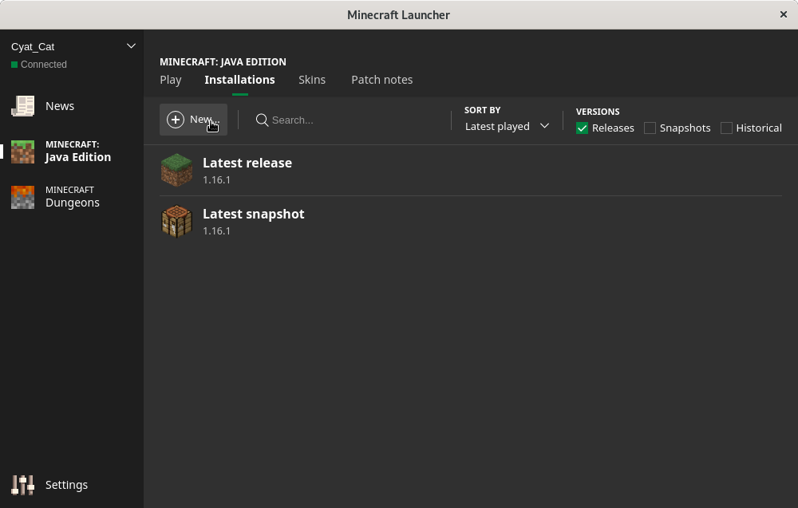
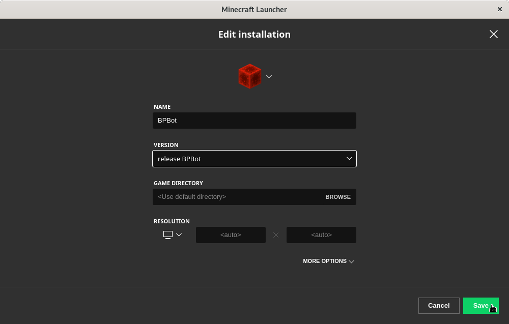
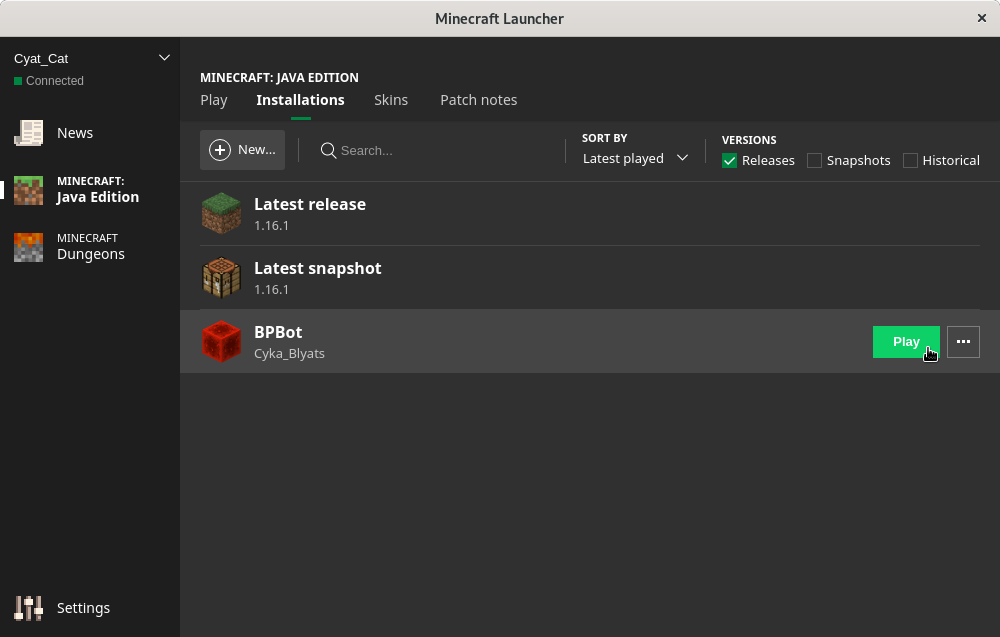

# bp-bot
## Inspiration
* **Tired of wasting your life away on Block Party, but you still want to earn those points?**

* **Are your fingers sore from playing too much, but you still want to earn those points?**

* **Or do you just want to step away from the computer for a moment, and still earn those points?**

BPBot helps prevent carpal tunnel syndrome by automating game play for the weary.

## What does it do?
This is a standard minecraft client (using v 1.12) which has some additional code to automate your Block Party player.

When BPBot auto mode is enabled, the following actions occur:
* Scans the floor to detect the blocks.
* When the color is called, it will run the player to the closest block.
* After stopping on a block, BPBot will perform some intermission moves.
* Once a new floor is loaded, BPBot will reposition your player at location that has the best probability (i.e. where the most colors are).

Other features include:
* Snarky chat messages when people fall.
* Automatic exit to new game.
* Automatic movement in the lobby.

## Installation
* #### Locate your minecraft versions folder:
| OS       | Location     |
|----------|:-------------|
| Windows |  %APPDATA%\\.minecraft\versions |
| macOS   |    ~/Library/Application Support/minecraft/versions |
| Linux   | ~/.minecraft/versions |

More details regarding your .minecraft folder can be found here [https://minecraft.gamepedia.com/.minecraft](https://minecraft.gamepedia.com/.minecraft).

* ####  Copy the BPBot folder from this repo into your minecraft versions directory:

For example:
```
.minecraft\versions\BPAuto'
```

* ####  Start the minecraft launcher and create a new installation


* ####  Select the newly added version (release BPBot) from the drop down menu


* ####  Play the newly create installation like normal


## Instructions
* Once in game, press the `m` key to open the menu.  
* With the menu open, press the `1` key to enable BP Auto mode.  
* Press the `m` key once again to close the menu.

### Controls
* `m` - toggles the main menu
* `1` - toggles BP Auto mode
* `s` - toggles speed boost
* `j` - toggles jump boost
* `u` - toggles high stepping
* `d` - toggles debug logging messages
